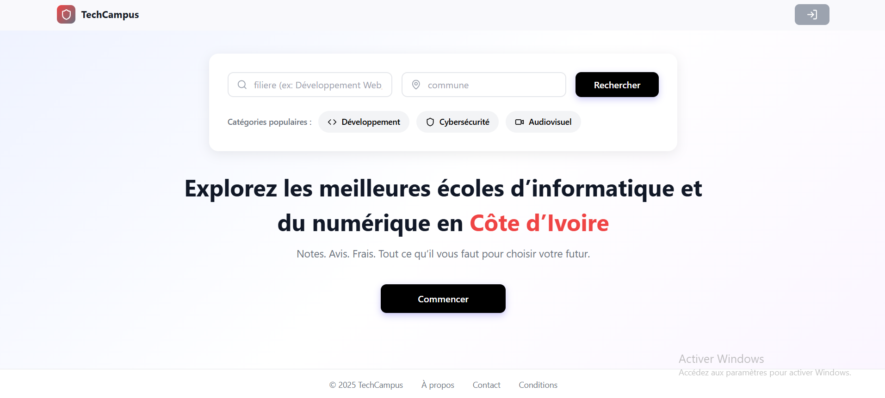
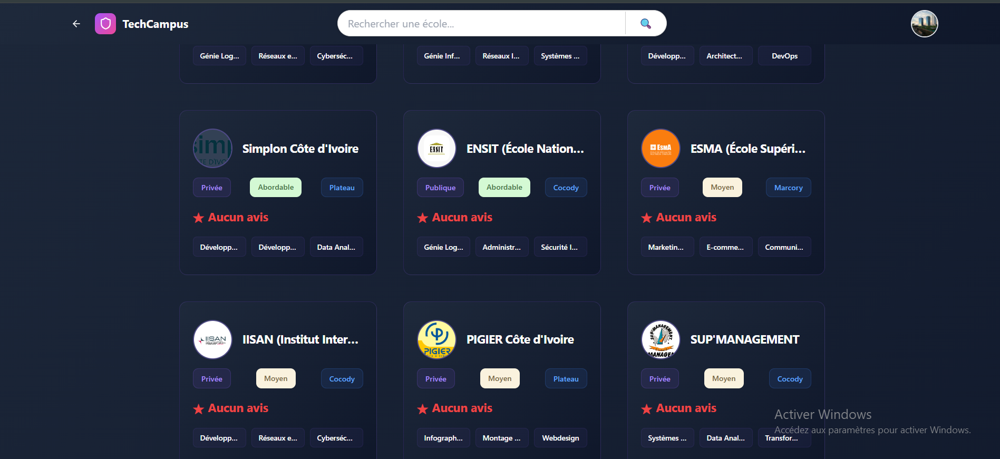
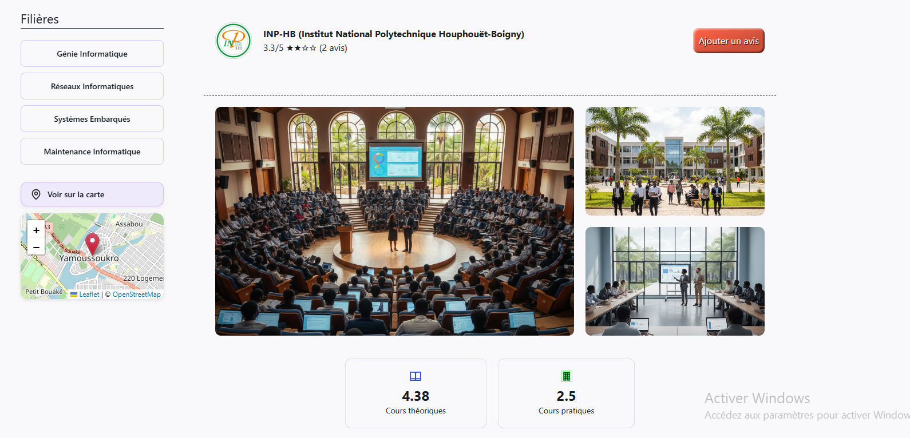
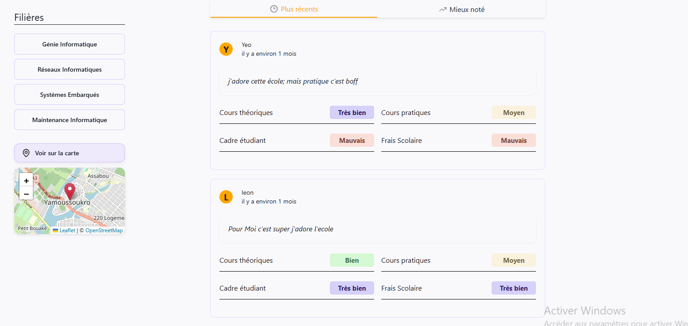

# 🎓 TechCampus - Trouvez les Meilleures Écoles du digital de Côte d'Ivoire

> Plateforme moderne pour découvrir, comparer et évaluer les établissements scolaires ivoiriens

[](VOTRE_URL_VERCEL)
[](VOTRE_URL_RENDER)
[](https://react.dev/)

[English version](#english-version) | [Backend Repository →](https://infoedu.onrender.com)

---

## 📸 Aperçu de l'Application

### Page d'Accueil

*Interface d'accueil avec recherche*

### Recherche et Filtres

*Recherche avancée par localisation, type d'école et niveau*

### Liste des écoles actuelle

*Bref liste des écoles actuelle*

### Détails de l'École


*Fiche complète : des photos de l'écoles, les filiès disponibles, informations, avis, localisation carte*


> 🎥 **[Voir la Démo Complète en Vidéo (3 min)](https://vimeo.com/1146345934?fl=ip&fe=ec)**

---

## ✨ Fonctionnalités Principales

### 🔍 Recherche Intelligente
- **Recherche multi-critères** : nom, commune


### 🏫 Fiches Écoles Détaillées
- Informations complètes (description, avis sur le cadre, la théorie, pratique etc...)
- Photos et galerie d'images
- Coordonnées et horaires
- **Géolocalisation sur carte interactive**

### ⭐ Système d'Avis
- **Notez et commentez** les écoles
- Consultez les avis d'autres parents/étudiants
- Moyenne des notes affichée


### 📱 Design Responsive
- **100% adapté mobile** (smartphone, tablette)
- Interface intuitive et moderne
- Performance optimisée

---

## 🛠️ Technologies Utilisées

### Frontend Core
- **React 18+** - Bibliothèque UI moderne
- **React Router v6** - Navigation fluide

### Styling
- **Styled Components** - CSS-in-JS pour composants stylés
- **Tailwind CSS** - Utility classes pour layout rapide
- Design system cohérent et maintenable

### State & Data
- **React Context API** - Gestion d'état globale (auth, favoris)
- **Axios** - Client HTTP pour appels API

### Maps & Geolocation
- **Leaflet**
- Géolocalisation des établissements

### Autres Outils
- **React Hook Form** - Gestion formulaires performante
- **React Icons** - Icônes modernes

---

## 📋 Prérequis

- Node.js 18+ et npm/yarn
- Compte Vercel (pour déploiement, gratuit)

---

## ⚙️ Installation et Configuration


### 1. Installer les Dépendances

```bash
npm install
# ou
yarn install
```

### 2. Configuration des Variables d'Environnement

Créez un fichier `.env` à la racine :

```env
# URL de l'API Backend
REACT_APP_API_URL=http://localhost:3000


# Autres configurations
REACT_APP_ENV=development
```

> ⚠️ **Important** : Ne commitez JAMAIS le fichier `.env` avec vos vraies clés API !

### 3. Lancer l'Application en Mode Développement

```bash
npm start
```

L'application sera accessible sur **http://localhost:3000**

### 5. Build de Production

```bash
npm run build
```

Les fichiers optimisés seront dans le dossier `build/`

---

## 🗂️ Structure du Projet

```
techcampus-frontend/
├── public/
│   ├── index.html
│   └── assets/              # Images, icônes statiques
│
├── src/
│   ├── components/          # Composants réutilisables
│   │   ├── common/          # Button, Input, Card, etc.
│   │   ├── layout/          # Header, Footer, Sidebar
│   │   ├── schools/         # SchoolCard, SchoolList, etc.
│   │   └── auth/            # LoginForm, RegisterForm
│   │
│   ├── pages/               # Pages principales
│   │   ├── Home.tsx
│   │   ├── SearchResults.tsx
│   │   ├── SchoolDetail.tsx
│   │   ├── Dashboard.tsx
│   │   ├── Login.tsx
│   │   └── Register.tsx
│   │
│   ├── services/            # API calls
│   │   ├── api.ts           # Configuration Axios
│   │   ├── authService.ts
│   │   └── schoolService.ts
│   │
│   ├── context/             # Context API
│   │   ├── AuthContext.tsx
│   │   └── FavoritesContext.tsx
│   │
│   ├── hooks/               # Custom hooks
│   │   ├── useAuth.ts
│   │   ├── useSchools.ts
│   │   └── useGeolocation.ts
│   │
│   ├── styles/              # Styled Components themes
│   │   ├── GlobalStyles.ts
│   │   ├── theme.ts
│   │   └── variables.ts
│   │
│   ├── utils/               # Fonctions utilitaires
│   │   ├── formatters.ts
│   │   └── validators.ts
│   │
│   ├── types/               # TypeScript types
│   │   └── index.ts
│   │
│   ├── App.tsx              # Composant racine
│   └── index.tsx            # Point d'entrée
│
├── screenshots/             # Images pour README
├── .env.example
├── package.json
└── README.md
```

---

## 🌐 Déploiement sur Vercel

### Méthode 1 : Via GitHub (Recommandée)

1. Push ton code sur GitHub
2. Connecte-toi sur [vercel.com](https://vercel.com)
3. "New Project" → Import ton repo GitHub
4. Configure les variables d'environnement :
   - `REACT_APP_API_URL` = URL de ton backend Render
5. Deploy ! ✅

Vercel déploie automatiquement à chaque push sur `main`


### Utilisation Tailwind CSS

```tsx
<div className="flex items-center justify-between p-4 bg-white rounded-lg shadow">
  <h2 className="text-xl font-bold">École Example</h2>
</div>
```

---

## 🐛 Problèmes Connus & Solutions

### CORS lors du développement local

**Problème :** Erreurs CORS entre frontend (localhost:3000) et backend (localhost:3001)

**Solution :** Le backend doit autoriser `http://localhost:3000` dans les CORS. Voir [Backend README](LIEN_BACKEND_REPO#cors-configuration)

### Images ne s'affichent pas

**Vérifiez :** 
- Les URLs d'images retournées par l'API sont complètes
- Les images sont hébergées sur un CDN accessible (Cloudinary, etc.)

---


## 👨‍💻 Auteur

**[yeo pevrogui noel]**  
Développeur Full Stack JavaScript/TypeScript

- 📧 Email : yeopevroguinoel@gmail.com
- 🐙 GitHub : [@yeonoel](https://github.com/yeonoel)

---

## 🙏 Remerciements

- [React Documentation](https://react.dev/)
- [Styled Components](https://styled-components.com/)
- [Tailwind CSS](https://tailwindcss.com/)

---


<a name="english-version"></a>
# 🇬🇧 TechCampus - Find the Best Schools in Ivory Coast

> Modern platform to discover,  review educational institutions in Côte d'Ivoire

## ✨ Key Features

- 🔍 **Smart Search** - Multi-criteria search (name, city, level)
- 🏫 **Detailed School Profiles** - Complete info, photos, contact
- 📍 **Interactive Maps** - Geolocation of schools
- ⭐ **Review System** - Rate and comment on schools
- 📱 **Fully Responsive** - Optimized for mobile, tablet, desktop

## 🛠️ Tech Stack

**Frontend:** React 18, TypeScript, Styled Components, Tailwind CSS  
**State Management:** React Context API  
**Maps:** Leaflet / Google Maps API  
**Hosting:** Vercel

## 🚀 Quick Start

```bash
# Clone and install
git clone https://github.com/yeonoel/front-university
cd frontend
npm install

# Configure environment
cp .env.example .env
# Edit .env with your API URL

# Run development server
npm start
```

Visit **http://localhost:3000**

## 👨‍💻 Author

**[Yeo pevrogui noel]** - Full Stack JavaScript Developer  
Specialized in React, NestJS, TypeScript, Spring boot

---

**⭐ Star this repo if you find it useful!**

---
